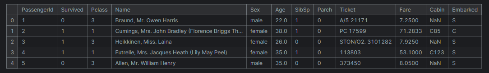
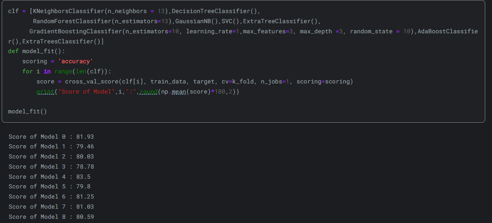

## Machine Learning

# Data Set
 
One of the project that I have done was Machine Learning and the dataset is regarding about titanic survival prediction. The dataset is from Kaggle and it is a binary classification problem. The dataset contains 891 rows and 12 columns. The dataset contains the following columns:  

:::: {.columns}
::: {.column width="20%"}

- PassengerId
- Survived
- Pclass
- Name
- Sex
- Age
- SibSp
- Parch
- Ticket
- Fare
- Cabin
- Embarked

:::
::: {.column width="80%"}

{.lightbox}

:::
::::

# Model Selection
 
There were data cleaning required for the dataset such as handling missing values, encoding categorical variables, and feature scaling. The dataset was split into training and testing set. The model was trained by mutliple algorithms such as Logistic Regression, K-Nearest Neighbors, Support Vector Machine, Decision Tree, Random Forest, and Gradient Boosting. The model was evaluated using accuracy, precision, recall, and F1-score. The model with the highest accuracy was SVC with 83.5%.

